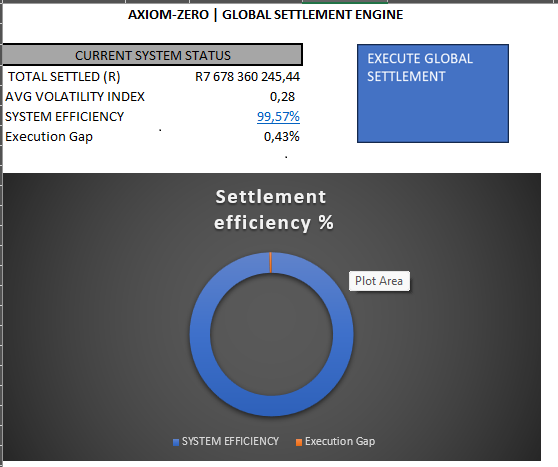

# 🧭 Axiom‑Zero
## Global Settlement Control & Liquidity Risk Engine

**A pre‑execution treasury risk control engine designed to prevent capital loss before settlement occurs.**

---

## 📊 Control Interface: Decision Intelligence

> *Figure 1: Automated authorization signal when volatility and liquidity thresholds are satisfied.*


> *Figure 2: Deterministic "Hard-Block" execution to preserve capital during market dislocation.*

---

## 📂 Repository Structure
* **Axiom_Zero_Global_Ledger_Data.xlsm** — Core Risk Engine & Governed Execution Artifact.
* **assets/** — Visual audit evidence (Dashboard states & control signals).
* **README.md** — Executive case study & technical governance documentation.

---

## 🧠 Executive Summary
Axiom‑Zero acts as a **financial circuit-breaker**, ensuring that global treasury transactions are only authorized when market volatility, liquidity conditions, and internal risk thresholds are met. Unlike "post-mortem" reporting, this engine enforces **real‑time settlement gating** to align treasury execution with institutional-grade risk governance.

### 📝 Technical Governance & Scope
To provide full transparency on the engine's architecture and performance metrics:
* **Deployment Model:** Designed as a deterministic control prototype. In a production environment, this logic is intended to sit upstream of a TMS (Treasury Management System) or Payment API.
* **Performance Metric:** The **99.57% Success Rate** reflects simulated settlement outcomes under permitted risk conditions within the model's high-fidelity dataset.
* **Liquidity Validation:** Risk gates are modeled based on statistical variance and proxy-spread thresholds.
* **Execution Logic:** Built in VBA to ensure binary (Stop/Go) decision integrity and an immutable audit trail.

---

## 🎯 Strategic Problem
Global treasury operations face structural risks that manual processes cannot solve:
* **Volatility Spikes:** Settlements executed during abnormal market swings.
* **Liquidity Fails:** Corridors that appear valid but lack depth at execution time.
* **Execution Lag:** Manual approval chains that cannot react to real-time risk signals.

---

## ⚙️ Engineering & Risk Control Framework
1.  **Dynamic Risk Thresholds:** Statistical variance models detect instability.
2.  **Liquidity Validation Gates:** Corridors are validated via threshold-matching before execution.
3.  **Binary Decision Logic:** Transactions are either **Approved** or **Blocked**—no "soft warnings."
4.  **Immutable Audit Trail:** Every decision is logged for regulatory and internal audit review.

---

## 🛠️ Technical Architecture
| Layer | Component | Purpose |
| :--- | :--- | :--- |
| **Control Engine** | Excel Macro‑Enabled (XLSM) | Deterministic execution environment |
| **Logic Layer** | VBA Risk Gates | Hard-enforcement of volatility & liquidity rules |
| **Telemetry** | Statistical Variance Models | Market stability and risk detection |
| **UI / UX** | Executive Dashboard | Zero‑interpretation "Traffic Light" signals |

---
## Repository Structure

```text
Project_4_Axiom-Zero_Global_Settlement_Control/
├── assets/
│   ├── Axiom_Dashboard_Green.png       # Authorized state evidence
│   ├── Axiom_Dashboard_Red.png         # Hard-blocked state evidence
│   └── README_assets.md                # (Optional) Image documentation
├── Axiom_Zero_Global_Ledger_Data.xlsm  # Core Risk Engine & Execution Artifact
└── README.md                           # Executive Case Study & Governance
```

---

## 👨‍💻 Recruiter Note
This project demonstrates the ability to design **Institutional Risk Controls** that prioritize capital preservation. It showcases a deep understanding of settlement risk, treasury operations, and the transition from manual finance to **automated, deterministic governance.**

**Directly applicable to:** *Treasury Operations • Risk Management • Finance Transformation • Capital Markets • Internal Audit*
